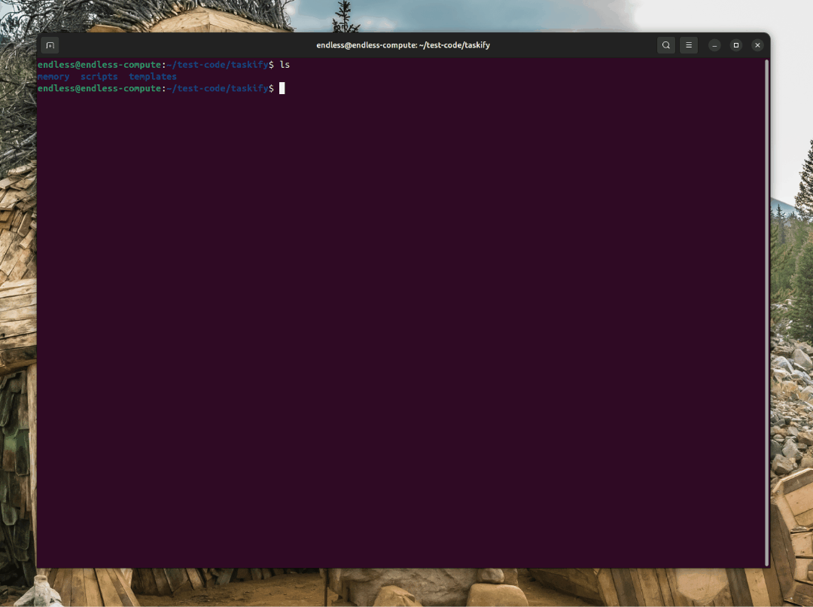

<div align="center">
    
    <h1>🌱 Spec-Kit Enhanced Fork v2.0</h1>
    <h3><em>Enhanced Spec-Driven Development with Brownfield Intelligence & Agent Self-Regulation</em></h3>
</div>

<p align="center">
    <strong>An enhanced fork of GitHub's Spec-Kit with brownfield analysis, agent self-regulation, complexity tiers, and intelligent orchestration—100% backward compatible.</strong>
</p>

[](https://github.com/mbpfws/speckit-buff-v2/actions/workflows/release.yml)
[](https://github.com/github/spec-kit)

---

## Table of Contents

- [🤔 What is Spec-Kit Enhanced Fork?](#-what-is-spec-kit-enhanced-fork)
- [✨ What's New in Enhanced Fork v2.0](#-whats-new-in-enhanced-fork-v20)
- [⚡ Quick Start](#-quick-start)
- [🤖 Supported AI Platforms](#-supported-ai-platforms)
- [🔧 CLI Reference](#-cli-reference)
- [📚 Core Philosophy](#-core-philosophy)
- [🔍 Migration from Original Spec-Kit](#-migration-from-original-spec-kit)
- [🔧 Prerequisites](#-prerequisites)
- [🔍 Troubleshooting](#-troubleshooting)
- [👥 Maintainers](#-maintainers)
- [💬 Support](#-support)
- [🙏 Acknowledgements](#-acknowledgements)
- [📄 License](#-license)

## 🤔 What is Spec-Kit Enhanced Fork?

Spec-Kit Enhanced Fork v2.0 is an **enhanced version** of GitHub's Spec-Kit with powerful new features while maintaining 100% backward compatibility:

- **🎯 Simple**: CLI under 400 lines, `init` and enhanced `check` commands
- **📝 Template-Driven**: Enhanced templates with complexity tiers and brownfield analysis
- **🤖 Agent-Native**: Leverages AI capabilities with self-regulation and citation requirements
- **🌐 Cross-Platform**: Works on all 11 major AI coding platforms
- **⚡ Lightweight**: Minimal dependencies (typer, rich, httpx)
- **🔍 Brownfield Intelligence**: 4-pass analysis workflow for existing codebases
- **🎓 Complexity Tiers**: Novice/Intermediate/Expert template sections
- **🔗 Intelligent Orchestration**: Auto-workflow chaining and context management

## ✨ What's New in Enhanced Fork v2.0

### 🆕 Brownfield Intelligence
- **4-Pass Analysis Workflow**: Document → Analyze → Integrate → Risk assessment
- **Tech Stack Detection**: Automatic detection for JS/TS, Python, Java, Ruby, Go, Rust
- **Confidence Levels**: High/Med/Low confidence reporting for all findings
- **Integration Strategy**: Templates for migrating existing codebases

### 🎓 Complexity Tier System
- **Novice/Intermediate/Expert**: Templates adapt to user skill level
- **Conditional Sections**: `<!-- IF tier=X -->` syntax for targeted guidance
- **Tier-Based Scaffolding**: Generate appropriate boilerplate for skill level

### 🤖 Agent Self-Regulation
- **User Confirmation Loops**: CRITICAL/MAJOR/MINOR severity thresholds
- **Citation Requirements**: "According to [URL]" format for all research
- **"I Don't Know" Protocol**: Prefer research over guessing
- **No Auto-Fix**: Agents must get permission before corrections

### 🔗 Intelligent Orchestration
- **Auto-Workflow Chaining**: Workflows trigger other workflows based on conditions
- **Context Management**: `.specify/context.json` stores workflow state
- **Complexity-Driven Research**: Multi-stage research for complex features
- **Domain Detection**: Automatic identification of multi-domain features

### ✅ Enhanced Check Command
- **`--tags`**: Validate code tags (TODO/FIXME/TASK-XXX)
- **`--dependencies`**: Check for vulnerabilities (npm audit, pip check)
- **`--tasks`**: Sync YAML ↔ code tags ↔ git
- **`--all`**: Run all checks at once

### 📦 26 New Scripts
- **3 Functional**: analyze-codebase, sync-tasks, enhanced check-prerequisites
- **23 Structured Stubs**: Ready for implementation with clear patterns
- **Cross-Platform**: All bash + PowerShell pairs

### 🌐 Enhanced Cross-Platform Support
- **11 AI Platforms**: Claude Code, Roo Code, GitHub Copilot, Cursor, Gemini CLI, Qwen Code, opencode, Windsurf, Kilo Code, Auggie CLI, Codex CLI
- **4 MVP Platforms**: Full support for Claude, Windsurf, Roo, Cursor
- **2 Installation Methods**: Both `uv tool` (persistent) and `uvx` (one-time) supported
- **Dual Scripts**: Bash (Unix/Linux/macOS) and PowerShell (Windows) validation scripts

## ⚡ Quick Start

### 1. Install Specify CLI

**Persistent Installation** (recommended):
```bash
uv tool install specify-cli --from git+https://github.com/mbpfws/speckit-buff-v2.git
```

**One-time Usage**:
```bash
# Note: Package is 'specify-cli' but executable is 'specify'
uvx --from git+https://github.com/mbpfws/speckit-buff-v2.git specify init my-project --ai roo

# Or in current directory
uvx --from git+https://github.com/mbpfws/speckit-buff-v2.git specify init --here --ai roo
```

### 2. Initialize Your Project

```bash
# Initialize with templates
specify init

# Execution time: <3 seconds
```

This creates:
- `.specify/templates/` - Markdown templates with agent guidance
- `.specify/scripts/` - Cross-platform validation scripts (bash + PowerShell)
- `specs/` - Directory for your specifications
- `.specify/config.yaml` - Configuration file

### 3. Create Features Using AI Agents

Your AI agent now has access to high-quality templates:

```bash
# Use agent commands (available in Claude Code, Windsurf, Roo Code, etc.)
/constitution         # Establish project principles
/specify              # Create feature specification (with tier detection)
/clarify              # Clarify underspecified areas
/plan                 # Generate technical implementation plan (with architecture research)
/tasks                # Break down into actionable tasks (with YAML metadata)
/analyze              # Verify consistency before implementation
/analyze-brownfield   # Analyze existing codebase (NEW)
/validate-governance  # Check tags and metadata (NEW)
/migrate-platform     # Move between AI platforms (NEW)
/implement            # Execute all tasks
```

### 4. Validate Your Work

```bash
# Run validation checks
specify check --all

# Validate code tags
specify check --tags

# Check dependencies for vulnerabilities
specify check --dependencies

# Sync task tracking
specify check --tasks
```

For complete workflows, see the [quickstart scenarios](./specs/003-based-on-the/quickstart.md).

## 📽️ Video Overview

Want to see Spec Kit in action? Watch our [video overview](https://www.youtube.com/watch?v=a9eR1xsfvHg&pp=0gcJCckJAYcqIYzv)!

[](https://www.youtube.com/watch?v=a9eR1xsfvHg&pp=0gcJCckJAYcqIYzv)

## 🤖 Supported AI Platforms

All 10 major AI coding platforms are supported with platform-specific templates:

| Platform | Tier | Integration | Notes |
|----------|------|-------------|-------|
| [Claude Code](https://www.anthropic.com/claude-code) | 1 | Full | MCP servers, hooks, automated workflows |
| [Roo Code](https://roocode.com/) | 1 | Full | Native command execution |
| [GitHub Copilot](https://code.visualstudio.com/) | 2 | Core | Manual setup required |
| [Cursor](https://cursor.sh/) | 2 | Advanced | IDE integration, context awareness |
| [Gemini CLI](https://github.com/google-gemini/gemini-cli) | 2 | Comprehensive | CLI interface |
| [Qwen Code](https://github.com/QwenLM/qwen-code) | 3 | Basic | Command support |
| [opencode](https://opencode.ai/) | 3 | Core | Framework functionality |
| [Windsurf](https://windsurf.com/) | 3 | Development | Environment integration |
| [Kilo Code](https://github.com/Kilo-Org/kilocode) | 3 | Lightweight | Basic support |
| [Auggie CLI](https://docs.augmentcode.com/cli/overview) | 3 | Basic | Command execution |

## 🔧 CLI Reference

### Commands

| Command | Description | Performance Target |
|---------|-------------|-------------------|
| `specify init` | Download templates and initialize project structure | <3 seconds |
| `specify check` | Run validation scripts and quality checks | <1 second |

### `specify init` Options

| Option | Description |
|--------|-------------|
| `--template-version VERSION` | Specify template version to download (default: `latest`) |
| `--force` / `-f` | Overwrite existing `.specify/` directory |
| `--offline` | Use cached templates without network access |
| `--minimal` | Install only essential templates (spec, plan, tasks, constitution) |

### `specify check` Options

| Option | Description |
|--------|-------------|
| `--quality` | Run quality tool checks (eslint, pylint, etc.) if configured |
| `--validation TYPE` | Which validation scripts to run: `all`, `structure`, `naming`, `frontmatter`, `none` |
| `--update-templates` | Check for newer template versions and prompt to update |
| `--fix` | Attempt automatic fixes for detected issues |
| `--format FORMAT` | Output format: `text`, `json`, `yaml` (default: `text`) |
| `--verbose` | Show detailed output including all validation messages |

### Examples

```bash
# Initialize with latest templates
specify init

# Initialize with specific template version
specify init --template-version v2.0.0

# Force overwrite existing .specify/
specify init --force

# Offline mode (use cached templates)
specify init --offline

# Minimal installation (essential templates only)
specify init --minimal

# Run all validation checks
specify check

# Run specific validation
specify check --validation naming

# Check with quality tools
specify check --quality

# Output as JSON
specify check --format json

# Check for template updates
specify check --update-templates

# Automatic fixes
specify check --fix
```

### Available Slash Commands

After running `specify init`, your AI coding agent will have access to these slash commands for structured development:

| Command         | Description                                                           |
|-----------------|-----------------------------------------------------------------------|
| `/constitution` | Create or update project governing principles and development guidelines |
| `/specify`      | Define what you want to build (requirements and user stories)        |
| `/clarify`      | Clarify underspecified areas (must be run before `/plan` unless explicitly skipped; formerly `/quizme`) |
| `/plan`         | Create technical implementation plans with your chosen tech stack     |
| `/tasks`        | Generate actionable task lists for implementation                     |
| `/analyze`      | Cross-artifact consistency & coverage analysis (run after /tasks, before /implement) |
| `/implement`    | Execute all tasks to build the feature according to the plan         |

### Environment Variables

| Variable         | Description                                                                                    |
|------------------|------------------------------------------------------------------------------------------------|
| `SPECIFY_FEATURE` | Override feature detection for non-Git repositories. Set to the feature directory name (e.g., `001-photo-albums`) to work on a specific feature when not using Git branches.<br/>**Must be set in the context of the agent you're working with prior to using `/plan` or follow-up commands. |

## 📚 Core Philosophy

Spec-Kit Enhanced Fork follows fourteen constitutional principles:

### Original Principles (I-VII)
1. **Cross-Platform Compatibility**: Support all 11 AI platforms across Windows, macOS, Linux
2. **Multi-Installation Support**: Work with both `uv tool` and `uvx` methods
3. **Template-Driven Consistency**: High-quality markdown templates as foundation
4. **Agent-Native Execution**: AI agents as primary actors, system augments
5. **Simplicity Principle**: CLI <400 LOC, minimal dependencies
6. **Governance Balance**: Non-blocking validation, user autonomy
7. **Backward Compatibility**: 100% compatible with original spec-kit

### Enhanced Principles (VIII-XIV)
8. **Intelligent Workflow Chaining**: Auto-triggers and conditional workflow execution
9. **Complexity-Driven Research**: Multi-stage research for complex features
10. **Context-Aware Execution**: Persistent workflow state in `.specify/context.json`
11. **Domain-Driven Architecture**: Research-driven architectural decisions
12. **Agent Self-Regulation**: User confirmation loops, citation requirements, severity thresholds
13. **Brownfield Support**: 4-pass analysis, confidence levels, file history tracking
14. **Context Management**: Section indexes, extraction tools, hierarchical navigation

See [memory/constitution.md](./memory/constitution.md) for complete details.

## 🔍 Migration from Original Spec-Kit

### What's Different
- **Enhanced**: Brownfield analysis, complexity tiers, agent self-regulation
- **Added**: 26 new scripts (3 functional + 23 stubs)
- **Extended**: 3 new constitutional principles (XII, XIII, XIV)
- **Improved**: Enhanced `check` command with --tags, --dependencies, --tasks
- **Repository**: Downloads from `mbpfws/speckit-buff-v2` instead of `github/spec-kit`

### Migration Steps
1. Install enhanced fork: `uv tool install specify-cli --from git+https://github.com/mbpfws/speckit-buff-v2.git`
2. Run in existing project: `specify check --all`
3. Explore new features: `/analyze-brownfield`, `/validate-governance`
4. All your existing specs work unchanged!

### Compatibility
✅ 100% backward compatible with original spec-kit  
✅ All original commands work identically  
✅ All original arguments and options preserved  
✅ Only repo URL changed  
✅ Enhanced features are optional and additive  
✅ No breaking changes

## 🔧 Prerequisites

- **Python 3.9+** (reduced from 3.11+)
- **uv** package manager - [Install uv](https://docs.astral.sh/uv/)
- **Git** (optional, for branch management)
- **AI coding agent** - Any of the 10 supported platforms

**No other dependencies required!** The CLI uses only standard library + 3 minimal packages.

## 📖 Learn more

- **[Complete Spec-Driven Development Methodology](./spec-driven.md)** - Deep dive into the full process
- **[Detailed Walkthrough](#-detailed-process)** - Step-by-step implementation guide

---

## 📋 Detailed process

<details>
<summary>Click to expand the detailed step-by-step walkthrough</summary>

You can use the Specify CLI to bootstrap your project, which will bring in the required artifacts in your environment. Run:

```bash
specify init <project_name>
```

Or initialize in the current directory:

```bash
specify init .
# or use the --here flag
specify init --here
# Skip confirmation when the directory already has files
specify init . --force
# or
specify init --here --force
```


You will be prompted to select the AI agent you are using. You can also proactively specify it directly in the terminal:

```bash
specify init <project_name> --ai claude
specify init <project_name> --ai gemini
specify init <project_name> --ai copilot
specify init <project_name> --ai cursor
specify init <project_name> --ai qwen
specify init <project_name> --ai opencode
specify init <project_name> --ai codex
specify init <project_name> --ai windsurf
# Or in current directory:
specify init . --ai claude
specify init . --ai codex
# or use --here flag
specify init --here --ai claude
specify init --here --ai codex
# Force merge into a non-empty current directory
specify init . --force --ai claude
# or
specify init --here --force --ai claude
```

The CLI will check if you have Claude Code, Gemini CLI, Cursor CLI, Qwen CLI, opencode, or Codex CLI installed. If you do not, or you prefer to get the templates without checking for the right tools, use `--ignore-agent-tools` with your command:

```bash
specify init <project_name> --ai claude --ignore-agent-tools
```

### **STEP 1:** Establish project principles

Go to the project folder and run your AI agent. In our example, we're using `claude`.



You will know that things are configured correctly if you see the `/constitution`, `/specify`, `/plan`, `/tasks`, and `/implement` commands available.

The first step should be establishing your project's governing principles using the `/constitution` command. This helps ensure consistent decision-making throughout all subsequent development phases:

```text
/constitution Create principles focused on code quality, testing standards, user experience consistency, and performance requirements. Include governance for how these principles should guide technical decisions and implementation choices.
```

This step creates or updates the `.specify/memory/constitution.md` file with your project's foundational guidelines that the AI agent will reference during specification, planning, and implementation phases.

### **STEP 2:** Create project specifications

With your project principles established, you can now create the functional specifications. Use the `/specify` command and then provide the concrete requirements for the project you want to develop.

>[!IMPORTANT]
>Be as explicit as possible about _what_ you are trying to build and _why_. **Do not focus on the tech stack at this point**.

An example prompt:

```text
Develop Taskify, a team productivity platform. It should allow users to create projects, add team members,
assign tasks, comment and move tasks between boards in Kanban style. In this initial phase for this feature,
let's call it "Create Taskify," let's have multiple users but the users will be declared ahead of time, predefined.
I want five users in two different categories, one product manager and four engineers. Let's create three
different sample projects. Let's have the standard Kanban columns for the status of each task, such as "To Do,"
"In Progress," "In Review," and "Done." There will be no login for this application as this is just the very
first testing thing to ensure that our basic features are set up. For each task in the UI for a task card,
you should be able to change the current status of the task between the different columns in the Kanban work board.
You should be able to leave an unlimited number of comments for a particular card. You should be able to, from that task
card, assign one of the valid users. When you first launch Taskify, it's going to give you a list of the five users to pick
from. There will be no password required. When you click on a user, you go into the main view, which displays the list of
projects. When you click on a project, you open the Kanban board for that project. You're going to see the columns.
You'll be able to drag and drop cards back and forth between different columns. You will see any cards that are
assigned to you, the currently logged in user, in a different color from all the other ones, so you can quickly
see yours. You can edit any comments that you make, but you can't edit comments that other people made. You can
delete any comments that you made, but you can't delete comments anybody else made.
```

After this prompt is entered, you should see Claude Code kick off the planning and spec drafting process. Claude Code will also trigger some of the built-in scripts to set up the repository.

Once this step is completed, you should have a new branch created (e.g., `001-create-taskify`), as well as a new specification in the `specs/001-create-taskify` directory.

The produced specification should contain a set of user stories and functional requirements, as defined in the template.

At this stage, your project folder contents should resemble the following:

```text
└── .specify
    ├── memory
    │	 └── constitution.md
    ├── scripts
    │	 ├── check-prerequisites.sh
    │	 ├── common.sh
    │	 ├── create-new-feature.sh
    │	 ├── setup-plan.sh
    │	 └── update-claude-md.sh
    ├── specs
    │	 └── 001-create-taskify
    │	     └── spec.md
    └── templates
        ├── plan-template.md
        ├── spec-template.md
        └── tasks-template.md
```

### **STEP 3:** Functional specification clarification (required before planning)

With the baseline specification created, you can go ahead and clarify any of the requirements that were not captured properly within the first shot attempt.

You should run the structured clarification workflow **before** creating a technical plan to reduce rework downstream.

Preferred order:
1. Use `/clarify` (structured) – sequential, coverage-based questioning that records answers in a Clarifications section.
2. Optionally follow up with ad-hoc free-form refinement if something still feels vague.

If you intentionally want to skip clarification (e.g., spike or exploratory prototype), explicitly state that so the agent doesn't block on missing clarifications.

Example free-form refinement prompt (after `/clarify` if still needed):

```text
For each sample project or project that you create there should be a variable number of tasks between 5 and 15
tasks for each one randomly distributed into different states of completion. Make sure that there's at least
one task in each stage of completion.
```

You should also ask Claude Code to validate the **Review & Acceptance Checklist**, checking off the things that are validated/pass the requirements, and leave the ones that are not unchecked. The following prompt can be used:

```text
Read the review and acceptance checklist, and check off each item in the checklist if the feature spec meets the criteria. Leave it empty if it does not.
```

It's important to use the interaction with Claude Code as an opportunity to clarify and ask questions around the specification - **do not treat its first attempt as final**.

### **STEP 4:** Generate a plan

You can now be specific about the tech stack and other technical requirements. You can use the `/plan` command that is built into the project template with a prompt like this:

```text
We are going to generate this using .NET Aspire, using Postgres as the database. The frontend should use
Blazor server with drag-and-drop task boards, real-time updates. There should be a REST API created with a projects API,
tasks API, and a notifications API.
```

The output of this step will include a number of implementation detail documents, with your directory tree resembling this:

```text
.
├── CLAUDE.md
├── memory
│	 └── constitution.md
├── scripts
│	 ├── check-prerequisites.sh
│	 ├── common.sh
│	 ├── create-new-feature.sh
│	 ├── setup-plan.sh
│	 └── update-claude-md.sh
├── specs
│	 └── 001-create-taskify
│	     ├── contracts
│	     │	 ├── api-spec.json
│	     │	 └── signalr-spec.md
│	     ├── data-model.md
│	     ├── plan.md
│	     ├── quickstart.md
│	     ├── research.md
│	     └── spec.md
└── templates
    ├── CLAUDE-template.md
    ├── plan-template.md
    ├── spec-template.md
    └── tasks-template.md
```

Check the `research.md` document to ensure that the right tech stack is used, based on your instructions. You can ask Claude Code to refine it if any of the components stand out, or even have it check the locally-installed version of the platform/framework you want to use (e.g., .NET).

Additionally, you might want to ask Claude Code to research details about the chosen tech stack if it's something that is rapidly changing (e.g., .NET Aspire, JS frameworks), with a prompt like this:

```text
I want you to go through the implementation plan and implementation details, looking for areas that could
benefit from additional research as .NET Aspire is a rapidly changing library. For those areas that you identify that
require further research, I want you to update the research document with additional details about the specific
versions that we are going to be using in this Taskify application and spawn parallel research tasks to clarify
any details using research from the web.
```

During this process, you might find that Claude Code gets stuck researching the wrong thing - you can help nudge it in the right direction with a prompt like this:

```text
I think we need to break this down into a series of steps. First, identify a list of tasks
that you would need to do during implementation that you're not sure of or would benefit
from further research. Write down a list of those tasks. And then for each one of these tasks,
I want you to spin up a separate research task so that the net results is we are researching
all of those very specific tasks in parallel. What I saw you doing was it looks like you were
researching .NET Aspire in general and I don't think that's gonna do much for us in this case.
That's way too untargeted research. The research needs to help you solve a specific targeted question.
```

>[!NOTE]
>Claude Code might be over-eager and add components that you did not ask for. Ask it to clarify the rationale and the source of the change.

### **STEP 5:** Have Claude Code validate the plan

With the plan in place, you should have Claude Code run through it to make sure that there are no missing pieces. You can use a prompt like this:

```text
Now I want you to go and audit the implementation plan and the implementation detail files.
Read through it with an eye on determining whether or not there is a sequence of tasks that you need
to be doing that are obvious from reading this. Because I don't know if there's enough here. For example,
when I look at the core implementation, it would be useful to reference the appropriate places in the implementation
details where it can find the information as it walks through each step in the core implementation or in the refinement.
```

This helps refine the implementation plan and helps you avoid potential blind spots that Claude Code missed in its planning cycle. Once the initial refinement pass is complete, ask Claude Code to go through the checklist once more before you can get to the implementation.

You can also ask Claude Code (if you have the [GitHub CLI](https://docs.github.com/en/github-cli/github-cli) installed) to go ahead and create a pull request from your current branch to `main` with a detailed description, to make sure that the effort is properly tracked.

>[!NOTE]
>Before you have the agent implement it, it's also worth prompting Claude Code to cross-check the details to see if there are any over-engineered pieces (remember - it can be over-eager). If over-engineered components or decisions exist, you can ask Claude Code to resolve them. Ensure that Claude Code follows the [constitution](base/memory/constitution.md) as the foundational piece that it must adhere to when establishing the plan.

### STEP 6: Implementation

Once ready, use the `/implement` command to execute your implementation plan:

```text
/implement
```

The `/implement` command will:
- Validate that all prerequisites are in place (constitution, spec, plan, and tasks)
- Parse the task breakdown from `tasks.md`
- Execute tasks in the correct order, respecting dependencies and parallel execution markers
- Follow the TDD approach defined in your task plan
- Provide progress updates and handle errors appropriately

>[!IMPORTANT]
>The AI agent will execute local CLI commands (such as `dotnet`, `npm`, etc.) - make sure you have the required tools installed on your machine.

Once the implementation is complete, test the application and resolve any runtime errors that may not be visible in CLI logs (e.g., browser console errors). You can copy and paste such errors back to your AI agent for resolution.

</details>

---

## 🔍 Troubleshooting

### Git Credential Manager on Linux

If you're having issues with Git authentication on Linux, you can install Git Credential Manager:

```bash
#!/usr/bin/env bash
set -e
echo "Downloading Git Credential Manager v2.6.1..."
wget https://github.com/git-ecosystem/git-credential-manager/releases/download/v2.6.1/gcm-linux_amd64.2.6.1.deb
echo "Installing Git Credential Manager..."
sudo dpkg -i gcm-linux_amd64.2.6.1.deb
echo "Configuring Git to use GCM..."
git config --global credential.helper manager
echo "Cleaning up..."
rm gcm-linux_amd64.2.6.1.deb
```

## 👥 Maintainers

**Enhanced Fork**:
- mbpfws ([@mbpfws](https://github.com/mbpfws))

**Original Spec-Kit**:
- Den Delimarsky ([@localden](https://github.com/localden))
- John Lam ([@jflam](https://github.com/jflam))

## 💬 Support

For support with the enhanced fork, please open a [GitHub issue](https://github.com/mbpfws/speckit-buff-v2/issues/new). We welcome bug reports, feature requests, and questions about using the enhanced features.

For questions about the original Spec-Kit, visit the [original repository](https://github.com/github/spec-kit).

## 🙏 Acknowledgements

This enhanced fork is based on [GitHub's Spec-Kit](https://github.com/github/spec-kit) by [Den Delimarsky](https://github.com/localden) and [John Lam](https://github.com/jflam).

**Enhanced Features**:
- Brownfield intelligence and 4-pass analysis workflow
- Agent self-regulation with user confirmation loops
- Complexity tier system (Novice/Intermediate/Expert)
- Intelligent orchestration and context management
- 26 new cross-platform scripts (bash + PowerShell)
- 3 new constitutional principles

**Credits**: The original Spec-Kit project is heavily influenced by the work and research of John Lam.

## 📄 License

This project is licensed under the terms of the MIT open source license. Please refer to the [LICENSE](./LICENSE) file for the full terms.
